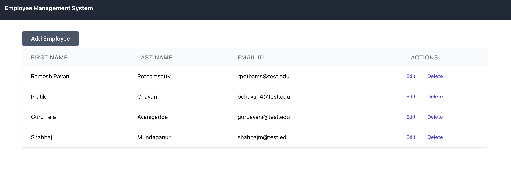
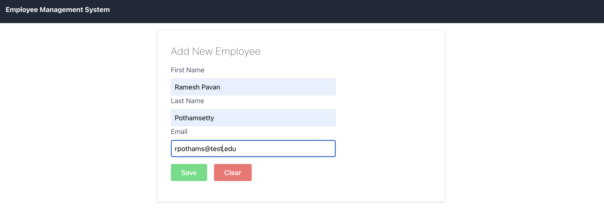

# EMS - A basic employee management portal built with React and Spring Boot.

A basic employee management portal built with React, Tailwind and Spring Boot. It handles all CRUD operations like create/edit employee, delete employee and show a list
current existing employees in database.

## Technologies used:

1. ReactJS
2. Java, Spring Boot
3. MySQL
4. Tailwind CSS

## Steps to run:

1. Clone the repository.
2. cd frontend && && npm install && npm run start.
3. cd employee-system-backend && start the run the main Java file.
4. Use the application straight away.

## Note

Install MySQL and create a employee database so that it can be configured in Spring Boot.
